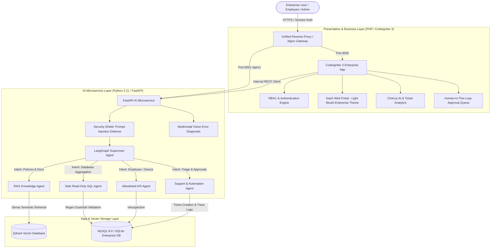

# AEGIS AI — Enterprise AI Support & Business Automation Platform

[](https://github.com/Nikhil9131/AegisAI-Enterprise-AI-Support-Automation-Agent/actions)
[](https://fastapi.tiangolo.com)
[](https://langchain-ai.github.io/langgraph/)
[](https://codeigniter.com)
[](https://www.php.net)
[](https://qdrant.tech)
[](https://www.docker.com)
[](https://aws.amazon.com)

**AEGIS AI** is a production-style, enterprise-grade AI IT Support and Business Automation Platform. It combines a high-performance **PHP 8.2 / CodeIgniter 3** web portal with a **Python 3.11 / FastAPI** multi-agent AI microservice powered by **LangChain**, **LangGraph**, and **Qdrant** vector database.

---

## 🏛️ System Architecture



---

## ✨ Core Features & Enterprise Capabilities

### 1. 🤖 LangGraph Multi-Agent Architecture
- **Supervisor Agent:** Dynamically inspects conversation history and intent, classifying queries into `RAG_AGENT`, `SQL_AGENT`, `API_AGENT`, `SUPPORT_AGENT`, or `DIRECT_RESPONSE`.
- **RAG Knowledge Agent:** Retrieves semantic embeddings from Qdrant vector database and synthesizes grounded answers with strict, verifiable citations (`[Document Title, Section X, Page Y]`).
- **Natural Language to SQL Agent:** Dynamically translates natural language inquiries into read-only SQL queries with regex guardrails blocking `DROP`, `DELETE`, `UPDATE`, `ALTER`, `TRUNCATE`, and privilege escalation.
- **System API Agent:** Allowlisted tool caller supporting `get_employee()`, `get_device()`, and `lookup_ticket()`.
- **Support & Automation Agent:** Automatically triages tickets, assesses priority (`LOW`, `MEDIUM`, `HIGH`, `CRITICAL`), and triggers Human-in-the-Loop workflows for privileged actions.

### 2. 🛡️ Human-in-the-Loop (HITL) Approval Workflows
Privileged operations (such as company laptop replacement requests, elevated access requests, or server reboots) cannot be executed autonomously. The agent automatically creates an approval gate and dispatches the action to the **IT Operations & Admin Queue** for human verification.

### 3. 📷 Multimodal Screenshot & Visual Diagnostics
Employees can upload error dialogs, Blue Screen of Death (BSOD) captures, or terminal crashes. The multimodal vision module extracts error codes (`NET-VPN-800-AUTH`, `0x0000007B`), analyzes root causes, provides immediate step-by-step remediation, and auto-populates support tickets.

### 4. 🔍 Vector Search & Ground Truth Citations
Dense semantic retrieval via **Qdrant** with **FastEmbed (`BAAI/bge-small-en-v1.5`)** and OpenAI embeddings. Supports ingestion of `.txt`, `.pdf` (`pypdf`), and `.docx` (`python-docx`) with exact page and section metadata preservation.

### 5. 📊 Real-Time AI Observability & Traces
The admin analytics dashboard captures latency (ms), token usage, routing decisions, tools executed, and user satisfaction ratings, stored in the `ai_agent_logs` table.

---

## 🔑 Demo Credentials & Test Accounts

| Role | Email | Password | Permissions |
| :--- | :--- | :--- | :--- |
| **IT Administrator** | `admin@aegis.enterprise` | `Admin@123` | Full Admin Console, Analytics, HITL Approvals, User Management, Logs |
| **Support Lead** | `agent.sarah@aegis.enterprise` | `Agent@123` | Ticket Queue, Resolution Suggestions, Diagnostic Tools |
| **Employee** | `rahul.sharma@aegis.enterprise` | `User@123` | AI Assistant, My Tickets, Ticket Submission, Knowledge Base |

*Note: The login page includes a 1-click credential selector for instant testing.*

---

## 🚀 Quick Start Guide

### Option A: Using Docker Compose (Recommended)

1. **Clone the repository:**
   ```bash
   git clone https://github.com/Nikhil9131/AegisAI-Enterprise-AI-Support-Automation-Agent.git
   cd "AegisAI-Enterprise-AI-Support-Automation-Agent"
   ```

2. **Launch all containers:**
   ```bash
   docker-compose up --build -d
   ```

3. **Access the application:**
   - **Unified Web Application:** `http://localhost:8080` (or `http://localhost:8000`)
   - **AI Microservice OpenAPI Docs:** `http://localhost:8001/docs`
   - **Qdrant Dashboard:** `http://localhost:6333/dashboard`

---

### Option B: Local Development Setup

#### 1. Database Initialization
```bash
python database/init_db.py
```
*Creates all 16 normalized tables and seeds initial employees, devices, tickets, policies, and AI traces.*

#### 2. Run Python FastAPI AI Microservice
```bash
cd ai-service
# Activate virtual environment
.venv\Scripts\activate   # Windows
source .venv/bin/activate # Linux/macOS

# Run FastAPI server
python -m uvicorn app.main:app --host 127.0.0.1 --port 8001 --reload
```

#### 3. Run CodeIgniter 3 Web Application
```bash
# In project root
php -S 127.0.0.1:8000 -t web-app
```
*Open your browser and navigate to `http://127.0.0.1:8000/auth/login`.*

---

## 🧪 Automated Test Suite

Run the full end-to-end multi-agent test suite:
```bash
# Live Agent Verification Test
python ai-service/tests/test_live_agents.py

# Multimodal Visual Diagnostics Test
python ai-service/tests/test_multimodal.py
```

---

## 📄 License
Enterprise Commercial License — Aegis AI Systems &copy; 2026. All rights reserved.
